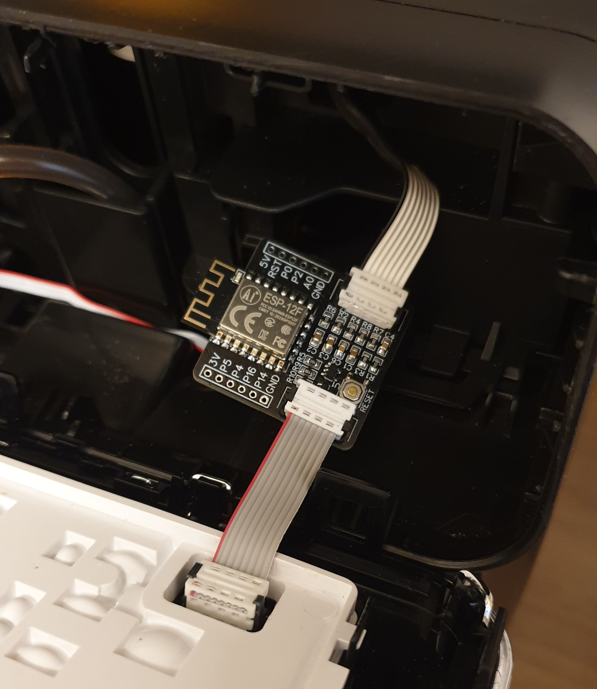
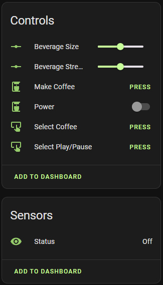
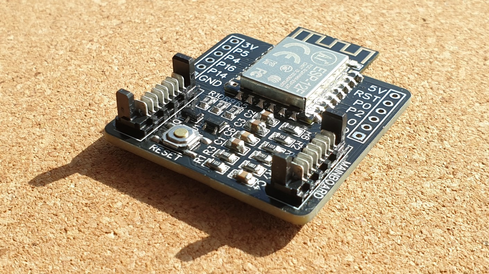

# ESPHome Smart Coffee (Philips Series 2200/3200) [](https://github.com/TillFleisch/ESPHome-Philips-Smart-Coffee/actions/workflows/ci.yaml)

This project integrates a Philips Series 2200/3200 Coffee Machine into into [Home Assistant](https://home-assistant.io) through [ESPHome](https://esphome.io).
This component has been developed on a Philips `EP2220` and an ESP8266 but it will happily run on an ESP32.
Currently supported Coffee Machine models include:

|Series     | Model Number        |
|-----------|---------------------|
|Series 2200| `EP2220`, `EP2235`  |
|Series 3200| `EP3243`, `EP3246`  |

My modified `EP2220`:

More information about the PCB used in this image is available [here](#custom-pcb).

This component provides a `Power Switch`, a `Status sensor` and various `Buttons` which simulate user input as well as a `Number` component to customize beverage settings such as size and strength.
The `Power Switch` can be used to turn on the coffee machine with and without a cleaning cycle during startup.



You might break/brick your coffee machine by modifying it in any way, shape or form. If you want to use this component, do so at your own risk.

# Configuration variables

A example configuration can be found [here](example.yaml)

## Philips Coffee Machine

- **id**(**Required**, string):Controller ID which will be used for entity configuration.
- **display_uart**(**Required**, string): ID of the UART-Component connected to the display unit
- **mainboard_uart**(**Required**, string): ID of the UART-Component connected to the mainboard
- **power_pin**(**Required**, [Pin](https://esphome.io/guides/configuration-types.html#config-pin)): Pin to which the MOSFET/Transistor is connected. This pin is used to temporarily turn of the display unit.
- **invert_power_pin**(**Optional**: boolean): If set to `true` the output of the power pin will be inverted. Defaults to `false`.
- **power_trip_delay**(**Optional**: Time): Determines the length of the power outage applied to the display unit, which is to trick it into turning on. Defaults to `500ms`.
- **power_message_repetitions**(**Optional**: uint): Determines how many message repetitions are used while turning on the machine. On some hardware combinations a higher value such as `25` is required to turn on the display successfully. Defaults to `5`.
- **language**(**Optional**: int): Status sensor language. Select one of `en-US`, `de-DE`, `it-IT`. Defaults to `en-US`.
- **model**(**Optional**: int): Different models or revisions may use different commands. This option can be used to specify the command set used by this component. Select one of `EP_2220`, `EP_2235`, `EP_3243`, `EP_3246`. Defaults to `EP_2220`.

## Philips Power switch

- **controller_id**(**Required**, string): The Philips Coffee Machine-Controller to which this entity belongs
- **clean**(**Optional**: boolean): If set to `true` the machine will perform a cleaning cycle during startup. Otherwise the machine will power on without cleaning. Defaults to `true`.
- All other options from [Switch](https://esphome.io/components/switch/index.html#config-switch)

## Action Button

- **controller_id**(**Required**, string): The Philips Coffee Machine-Controller to which this entity belongs
- **action**(**Required**, int): The action performed by this button. Select one of `SELECT_COFFEE`, `MAKE_COFFEE`, `SELECT_ESPRESSO`, `MAKE_ESPRESSO`, `SELECT_HOT_WATER`, `MAKE_HOT_WATER`, `SELECT_STEAM`, `MAKE_STEAM`, `SELECT_CAPPUCCINO`, `MAKE_CAPPUCCINO`, `SELECT_LATTE`, `MAKE_LATTE`, `SELECT_AMERICANO`, `MAKE_AMERICANO`, `BEAN`, `SIZE`, `MILK`, `AQUA_CLEAN`, `CALC_CLEAN`, `PLAY_PAUSE`. Note that some options are only available on select models.
- **long_press**(**Optional**, boolean): If set to `true` this button will perform a long press. This option is only available for actions which don't include `MAKE`.
- All other options from [Button](https://esphome.io/components/button/index.html#config-button)

## Philips Status Sensor

- **controller_id**(**Required**, string): The Philips Coffee Machine-Controller to which this entity belongs
- All other options from [Text Sensor](https://esphome.io/components/text_sensor/index.html#config-text-sensor)

## Bean and Size Settings

- **type**(**Required**, string): The type of this number component. One of `size`, `bean` and `milk`. If `size` is selected, this component will report/manipulate the beverage size. If `bean` is used, this component will report/manipulate the beverage strength. If `milk` is used, this component will report/manipulate the amount of milk added to the beverage. Note that some options are only available on select models.
- **controller_id**(**Required**, string): The Philips Coffee Machine-Controller to which this entity belongs
- **status_sensor_id**(**Required**, string): Id of a status sensor which is also connected to the controller.
- **source**(**Optional**, int): The source of this sensor. If non is provided, any selected beverage will enable this component. Select one of `COFFEE`, `ESPRESSO`, `HOT_WATER`, `CAPPUCCINO`, `AMERICANO`, `LATTE_MACCHIATO`. Note that some options are only available on select models or setting types.
- All other options from [Number](https://esphome.io/components/number/index.html#config-number)

# Fully automated coffee

The following script can be used to make a fully automated cup of coffee.
The power switch used in this case does not perform a cleaning cycle.
The cleaning check is required since after power loss the machine always cleans.
This script will only continue to brew coffee under 2 conditions:

- There was no cleaning cycle during start-up
- A Mug is present

```yaml
script:
  - id: coffee_script
    then:
      - if:
          condition:
            lambda: 'return id(status).state == "Off";'
          then:
            - switch.turn_on: power
            - wait_until:
                condition:
                  lambda: 'return (id(status).state == "Idle") || (id(status).state == "Cleaning");'
                timeout: 120s
            - if:
                condition:
                  lambda: 'return (id(status).state == "Idle") && id(mug_sensor).state;'
                then:
                  - delay: 5s
                  - button.press: make_coffee_button
          else:
            if:
              condition:
                lambda: 'return (id(status).state == "Idle") && id(mug_sensor).state;'
              then:
                - button.press: make_coffee_button
```

# Wiring

The coffee machines display unit is connected to the mainboard via a 8-pin ribbon cable with Picoflex connectors.
The display is powered by the mainboard and the two units communicate using a serial bus.
The ESP is placed in between this bus to perform a man-in-the-middle attack.
The RX/TX lines are piped through the ESP such that messages can be read, intercepted and injected.

When injecting a 'turn coffee machine on' command, the coffee machine does turn on, but the display unit does not. To circumvent this behavior we can re-boot the display unit by temporarily removing it's power. Thus the display will power on and operate normally. To perform this operation a transistor or MOSFET can be used.

The following wiring guideline can be used to add a Wemos D1 Mini to the coffee machine. **The unlabeled wires should be connected without changes.** More schematics are available [here](#custom-pcb).


The ribbon cable wires have the following functionalities.

| Pin | Mainboard | Functionality                      |
| --- | --------- | ---------------------------------- |
| 0   | 5V        | 5V                                 |
| 1   | GND       | GND                                |
| 2   | GND       | GND                                |
| 3   | unused    | unused                             |
| 4   | TX/RX     | Messages from mainboard to display |
| 5   | RX/TX     | Messages from display to mainboard |
| 6   | 0V        | unknown - very noisy               |
| 7   | 5V        |                                    |

## Voltage regulation

The Wemos D1 Mini has a built in Voltage regulator, thus connecting it to the 5V provided by the mainboard is no problem. If you use a different ESP Module/Board please make sure it is 5V tolerant or use a Voltage regulator. Otherwise you might release magic smoke.

# Custom PCB

This project has convinced me to design my first PCB (printed circuit board). This rather simple ESP8266-12F-based design was inspired by the Wemos D1 Mini, which I was using previously.
When using this PCB the ribbon cable connecting the mainboard to the display must not be cut in half and no soldering is required.



The Schematics, PCB Layout and BOM are available [here on oshwlab.com](https://oshwlab.com/tillf/philips-smart-coffee-pcb) and an accompanying 3D-printable case for the small PCB is available [here on printables.com](https://www.printables.com/model/826691-smart-coffee-pcb-case). The SMD components were chosen such that they can still be hand-soldered without a hot-air station or reflow oven, given a little experience. Since this is my first design there may be mistakes and things that could be optimized. Everything is provided as is, without warranty or liability of any kind.

There are also other PCB designs like [this one](https://oshwlab.com/tradstaat/coffeepcb) which relies on using a Wemos D1 Mini and does not require soldering SMD components.

# Communication protocol

More information on the communication protocol used by this component can be found [here](protocol.md).

# Related Work

- [SmartPhilips2200](https://github.com/chris7topher/SmartPhilips2200) by [@chris7topher](https://github.com/chris7topher)
  - The commands used in this Project are different. This is likely due to different model revisions.
- Thanks to [@quack3d](https://github.com/quack3d) and [@sendorm](https://github.com/sendorm) for helping add support for the `EP3243` and the `EP3246`.

# Troubleshooting

- Make sure your wiring is correct
- The UART debug function can be used to analyze communication and verify correct wiring
- The commands used by the display unit may be different between different revisions/models (see Related Work)

## Display not turning on

With some Hardware combinations and on some coffee machines, the display might not turn on reliably. If this is the case for you please try the following troubleshooting steps to resolve the issue:

- Double-check wiring
- Try increasing `power_message_repetitions` to `25` or some other value smaller/larger than this.
- Try increasing `power_trip_delay`
- Try adjusting `invert_power_pin` depending on the type of transistor used
