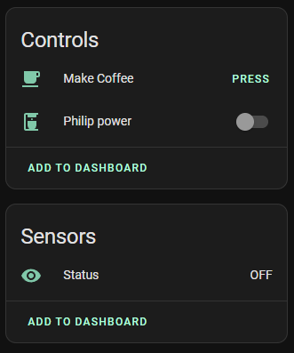
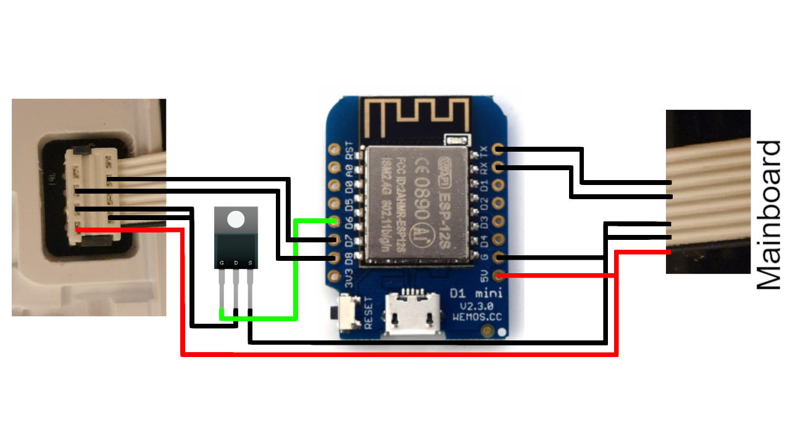

# ESPHome Smart Coffee (Philips Series 2200)

This project integrates a Philips Series 2200 Coffee Machine into into [Home Assistant](https://home-assistant.io) through [ESPHome](https://esphome.io).
This component has been developed on a Philips EP2220 and an ESP8266.

This component provides a `Power Switch`, a `Status sensor` and various `Buttons` which simulate user input.
The `Power Switch` can be used to turn on the coffee machine with and without a cleaning cycle during startup.



You might break/brick your coffee machine by modifying it in any way, shape or form. If you want to use this component, do so at your own risk.

# Configuration variables

A example configuration can be found [here](example.yaml)

## Philips Series 2200

- **id**(**Required**, string):Controller ID which will be used for entity configuration.
- **display_uart**(**Required**, string): ID of the UART-Component connected to the display unit
- **mainboard_uart**(**Required**, string): ID of the UART-Component connected to the mainboard
- **power_pin**(**Required**, [Pin](https://esphome.io/guides/configuration-types.html#config-pin)): Pin to which the MOSFET/Transistor is connected. This pin is used to temporarily turn of the display unit.
- **invert_power_pin**(**Optional**: boolean): If set to true the output of the power pin will be inverted. Defaults to `false`.
- **power_trip_delay**(**Optional**: Time): Determines the length of the power outage applied to the display unit, which is to trick it into turning on. Defaults to `1s`.

## Philips Power switch

- **controller_id**(**Required**, string): The Philips Series 2200-Controller to which this entity belongs
- **clean**(**Optional**: boolean): If set to true the machine will perform a cleaning cycle during startup. Otherwise the machine will power on without cleaning. Defaults to `true`.
- All other options from [Switch](https://esphome.io/components/switch/index.html#config-switch)

## Philips Action Button

- **controller_id**(**Required**, string): The Philips Series 2200-Controller to which this entity belongs
- **action**(**Required**, int): The action performed by this button. Select one of `MAKE_COFFEE`, `SELECT_COFFEE`, `SELECT_ESPRESSO`, `MAKE_ESPRESSO`, `SELECT_HOT_WATER`, `MAKE_HOT_WATER`, `SELECT_STEAM`, `MAKE_STEAM`, `BEAN`, `SIZE`, `AQUA_CLEAN`, `CALC_CLEAN`, `PLAY_PAUSE`.
- All other options from [Button](https://esphome.io/components/button/index.html#config-button)

## Philips Status Sensor

- **controller_id**(**Required**, string): The Philips Series 2200-Controller to which this entity belongs
- All other options from [Text Sensor](https://esphome.io/components/text_sensor/index.html#config-text-sensor)
- **use_cappuccino**(**Optional**, boolean): If set to true `Cappuccino selected` selected will be reported instead of `Steam selected`. This option is intended for machines like the EP2230 which can make cappuccino. Default to `false`.

## Bean Settings

- **controller_id**(**Required**, string): The Philips Series 2200-Controller to which this entity belongs
- **status_sensor_id**(**Required**, string): Id of a status sensor which is also connected to the controller.
- **source**(**Required**, int): The source of this sensor. Select one of `COFFEE`, `ESPRESSO`, `CAPPUCCINO`. When selecting `CAPPUCCINO` the related status sensor must use `use_cappuccino = true`.
- All other options from [Number](https://esphome.io/components/number/index.html#config-number)

## Size Settings

- **controller_id**(**Required**, string): The Philips Series 2200-Controller to which this entity belongs
- **status_sensor_id**(**Required**, string): Id of a status sensor which is also connected to the controller.
- **source**(**Required**, int): The source of this sensor. Select one of `COFFEE`, `ESPRESSO`, `CAPPUCCINO`, `HOT_WATER`. When selecting `CAPPUCCINO` the related status sensor must use `use_cappuccino = true`.
- All other options from [Number](https://esphome.io/components/number/index.html#config-number)

# Fully automated coffee

The following script can be used to make a fully automated cup of coffee.
The power switch used in this case does not perform a cleaning cycle.
The cleaning check is required since after power loss the machine always cleans.
This script will only continue to brew coffee under 2 conditions:

- There was no cleaning cycle during start-up
- A Mug is present

```yaml
script:
  - id: coffee_script
    then:
      - if:
          condition:
            lambda: 'return id(status).state == "OFF";'
          then:
            - switch.turn_on: power
            - wait_until:
                condition:
                  lambda: 'return (id(status).state == "Idle") || (id(status).state == "Cleaning");'
                timeout: 120s
            - if:
                condition:
                  lambda: 'return (id(status).state == "Idle") && id(mug_sensor).state;'
                then:
                  - delay: 5s
                  - button.press: make_coffee_button
          else:
            if:
              condition:
                lambda: 'return (id(status).state == "Idle") && id(mug_sensor).state;'
              then:
                - button.press: make_coffee_button
```

# Wiring

The coffee machines display unit is connected to the mainboard via a 8-pin ribbon cable with Picoflex connectors.
The display is powered by the mainboard and the two units communicate using a serial bus.
The ESP is placed in between this bus to perform a man-in-the-middle attack.
The RX/TX lines are piped through the ESP such that messages can be read, intercepted and injected.

When injecting a 'turn coffee machine on' command, the coffee machine does turn on, but the display unit does not. To circumvent this behavior we can re-boot the display unit by temporarily removing it's power. Thus the display will power on and operate normally. To perform this operation a transistor or MOSFET can be used.

The following wiring guideline can be used to add a Wemos D1 Mini to the coffee machine. **The unlabeled wires should be connected without changes.**


The ribbon cable wires have the following functionalities.

| Pin | Mainboard | Functionality                      |
| --- | --------- | ---------------------------------- |
| 0   | 5V        | 5V                                 |
| 1   | GND       | GND                                |
| 2   | GND       | GND                                |
| 3   | unused    | unused                             |
| 4   | TX/RX     | Messages from mainboard to display |
| 5   | RX/TX     | Messages from display to mainboard |
| 6   | 0V        | unknown - very noisy               |
| 7   | 5V        |                                    |

## Voltage regulation

The Wemos D1 Mini has a built in Voltage regulator, thus connecting it to the 5V provided by the mainboard is no problem. If you use a different ESP Module/Board please make sure it is 5V tolerant or use a Voltage regulator. Otherwise you might release magic smoke.

# Communication protocol

More information on the communication protocol used by this component can be found [here](protocol.md).

# Related Work

- [SmartPhilips2200](https://github.com/chris7topher/SmartPhilips2200) by [@chris7topher](https://github.com/chris7topher)
  - The commands used in this Project are different. This is likely due to different model revisions.

# Troubleshooting

- Make sure your wiring is correct
- The UART debug function can be used to analyze communication and verify correct wiring
- The commands used by the display unit may be different between different revisions/models (see Related Work)
